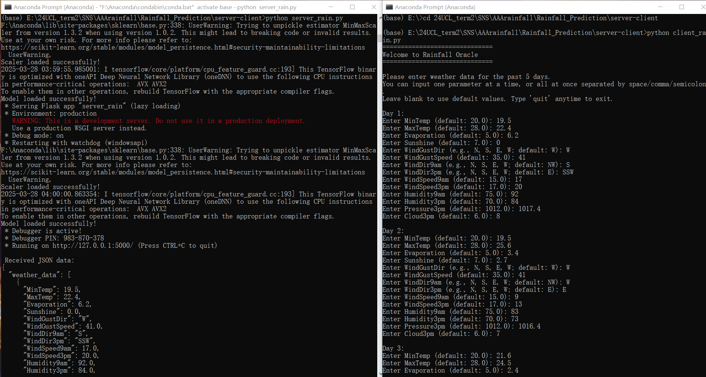
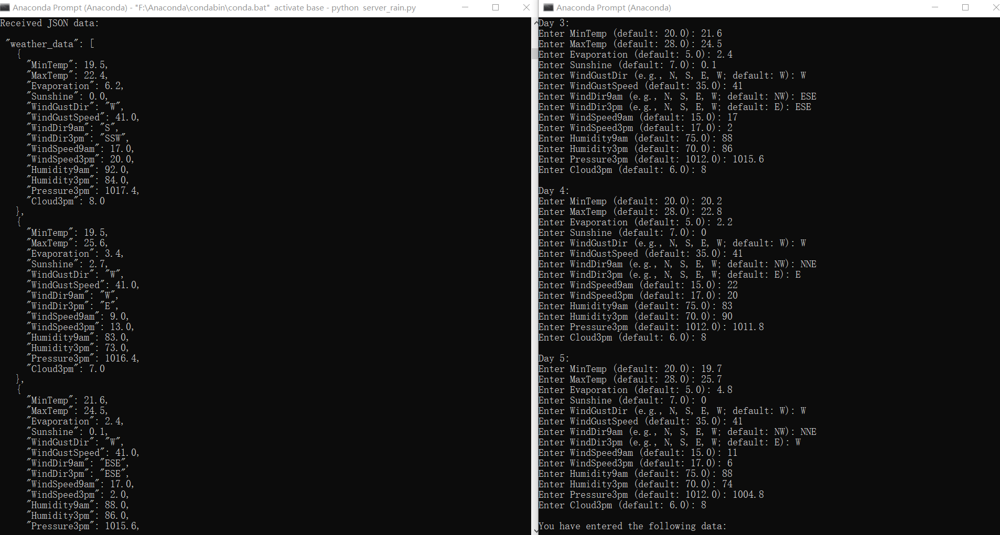
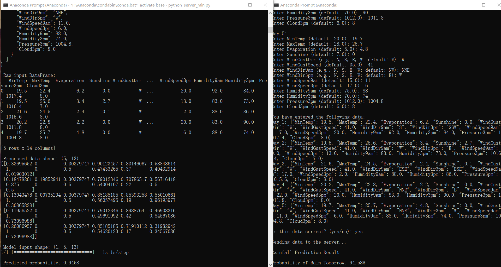
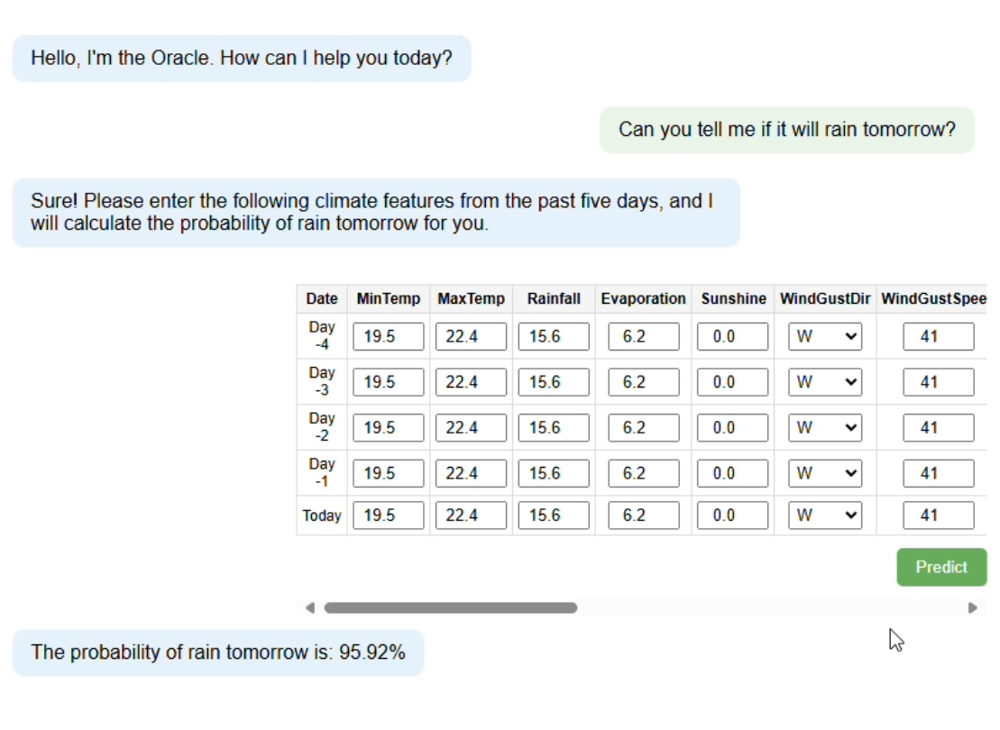

# Rainfall_Prediction Oracle – SNS Project 2024/2025

**Team Members:**
- Wei Du
- Yuning Zhou
- Haowen Yang

This project implements a time series forecasting Oracle chatbot for rainfall prediction using an LSTM model. It was developed for the UCL Software for Network Services (SNS) module.

The Oracle predicts future rainfall based on historical weather data and is accessed via a simple terminal-based client-server interface.
Users input 14 key weather features from the past 5 days. After preprocessing, the data is passed through the model to estimate the likelihood of rain the next day.


---

## Project Structure

```text
Rainfall_Prediction/
├── lstm_model/                         [ AUTHOR: Wei Du ]
│   ├── EDA.ipynb                      # Exploratory data analysis
│   ├── lstm_rainfall_best_config.py   # Final LSTM with best config
│   ├── lstm_rainfall_prediction_with_WandB.py  # Training with WandB tuning
│   ├── sweep_config.yaml              # WandB hyperparameter sweep setup
│   └── weather_data.csv               # Raw weather dataset
│
├── Example_Predict/                    [ AUTHOR: Wei Du ]
│   ├── predict.py                     # Script for loading model and predicting
│   ├── rain_prediction_lstm.h5        # Trained LSTM model
│   └── scaler_X.save                  # Scaler for input preprocessing
│
├── server-client/                      [ AUTHOR: Yuning Zhou ]
│   ├── client_rain.py                      # Simple terminal client
│   └── server_rain.py                      # Server hosting the Oracle model
│
├── user_interface/                     [ AUTHOR: Haowen Yang ]
│   ├── app.py                         # Flask app
│   └── index.html                     # Web interface template
│
└── README.md                           # Project documentation
```

---

## Features

- Time series forecasting using LSTM
- Model tuning using Weights & Biases (WandB)
- Command-line based Oracle chatbot (client-server architecture)
- Optional web interface built with Flask

---

## How to Run

This section describes how to train the model, run predictions, and interact with the Oracle via both terminal and web interfaces.

### 1. Train the model

Navigate to the `lstm_model` folder and run:

```bash
cd lstm_model
python lstm_rainfall_prediction_with_WandB.py
```

This script performs:
- Data preprocessing and feature engineering
- LSTM model training
- Hyperparameter tuning using Weights & Biases (WandB)
- Saving the trained model (`rain_prediction_lstm.h5`) and scaler (`scaler_X.save`)

---

### 2. Predict using the saved model

Navigate to the `Example_Predict` folder and run:

```bash
cd Example_Predict
python predict.py
```

This script loads the saved model and scaler, accepts user input, and makes a rainfall prediction.

---

### 3. Start the Oracle chatbot (terminal client-server interface)

Open **two separate terminals**.

**Terminal 1: Start the server**

```bash
cd server-client
python server.py
```

**Terminal 2: Start the client**

```bash
cd server-client
python client.py
```

You will see a prompt like:

```
Hello, I’m the Oracle. How can I help you today?
```

Type supported sentences like:

```
Can you give me the rainfall prediction for tomorrow?
```

The server will respond with a forecast based on the LSTM model.

---

### Example Results from the Server-Client Interface

**Figure 1: Flask server running successfully**  
The server loads the trained LSTM model and MinMaxScaler, binds to `http://127.0.0.1:5000`, and is ready to receive prediction requests from the client.  


**Figure 2: Client-side input and rainfall prediction**  
The client script collects 5 days of weather data from user input, sends it to the server, and receives a predicted probability of rainfall for the next day (e.g., 94.58%).  


**Figure 3: Server processing and model inference**  
The server prints the received JSON data, processes and scales the input, feeds it into the LSTM model, and outputs the final prediction.  


---

### 4. Launch the web interface

Navigate to the `user_interface` folder and run:

```bash
cd user_interface
python app.py
```

Then open your browser and go to:

```
http://127.0.0.1:5000
```
Use the web form to submit queries to the Oracle and view predictions in your browser.

---

### Example Output from the Web-based Oracle Interface

**Figure 4: Rainfall Oracle Web Interface**  
The user interacts with a chatbot-like interface. Upon asking a natural language question (e.g., "Can you tell me if it will rain tomorrow?"), the Oracle prompts the user to input key climate features from the past five days. These features—such as temperature, rainfall, evaporation, sunshine, and wind conditions—can be filled in using an interactive table.

Once submitted, the backend processes the data and returns a predicted probability of rainfall for the next day. In this example, the system outputs:  
> “The probability of rain tomorrow is: 95.92%”

This interface allows intuitive communication while abstracting away technical complexity, making the model accessible to non-expert users.



---

## Requirements

- Python 3.x
- tensorflow or keras
- pandas
- numpy
- scikit-learn
- wandb (for hyperparameter tuning)
- flask (for web interface)

---

## License

This project is developed for educational purposes as part of the SNS coursework at UCL. Not intended for commercial use.
